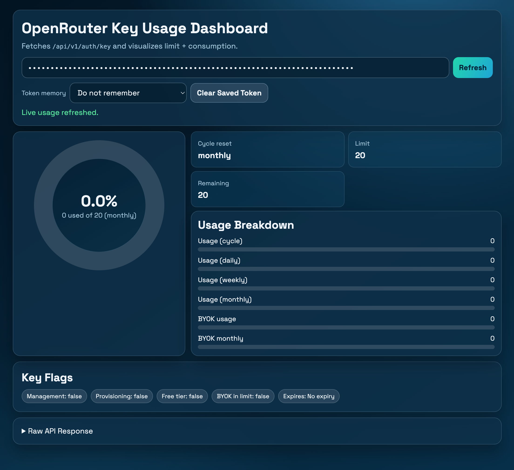

# OpenRouter Usage Dashboard (`index.html`)

## Personal Use

This dashboard was created for personal use to quickly check OpenRouter key usage in one place.

## Demo

## What It Does

- Calls `GET https://openrouter.ai/api/v1/auth/key`
- Uses your token in `Authorization: Bearer <token>`
- Shows usage data visually in the browser
- Supports manual refresh and automatic refresh every 5 minutes

## Quick Start

1. Open `index.html` in your browser.
2. Paste your OpenRouter token.
3. Click `Fetch Usage` (it changes to `Refresh` after first successful load).
4. Optional: choose how token memory works (`none`, `session`, or `local`).

## Privacy and Safety (Simple Version)

- No backend in this file.
- No custom analytics or telemetry in this file.
- Token is sent only to OpenRouter for usage retrieval.
- `sessionStorage`/`localStorage` are optional convenience features with tradeoffs.

## Important Notes

- If your browser environment is compromised (malicious extension/XSS), stored tokens can be exposed.
- The page loads Google Fonts by default; remove the font link if you want fewer third-party requests.
